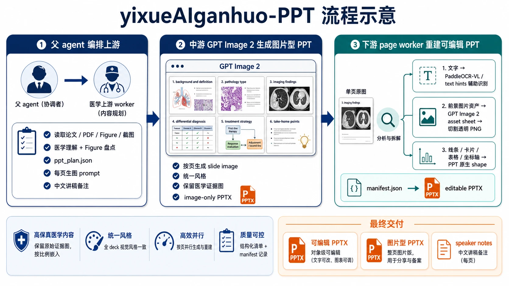
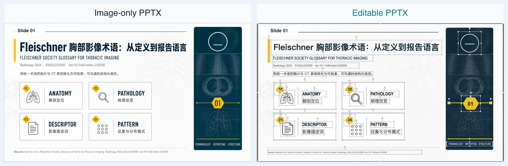
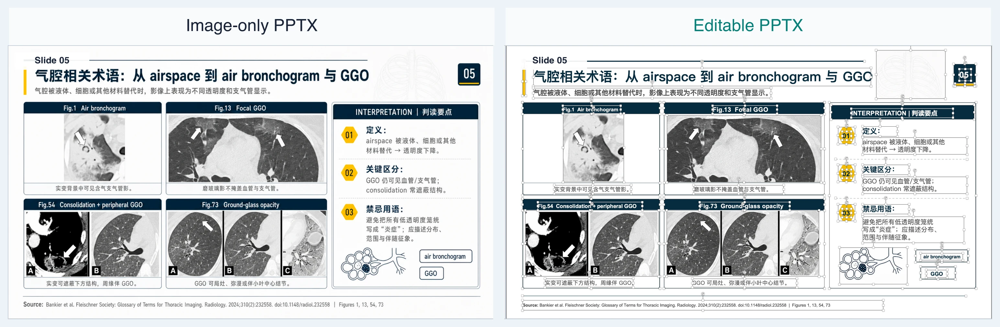
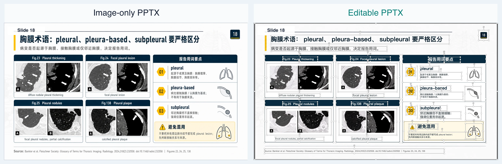
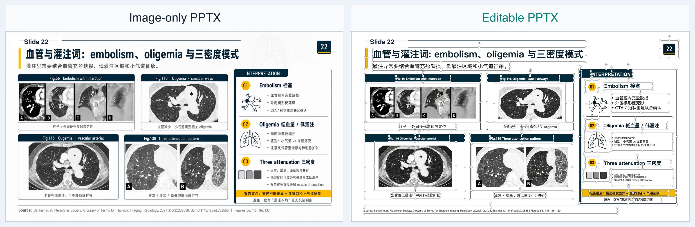
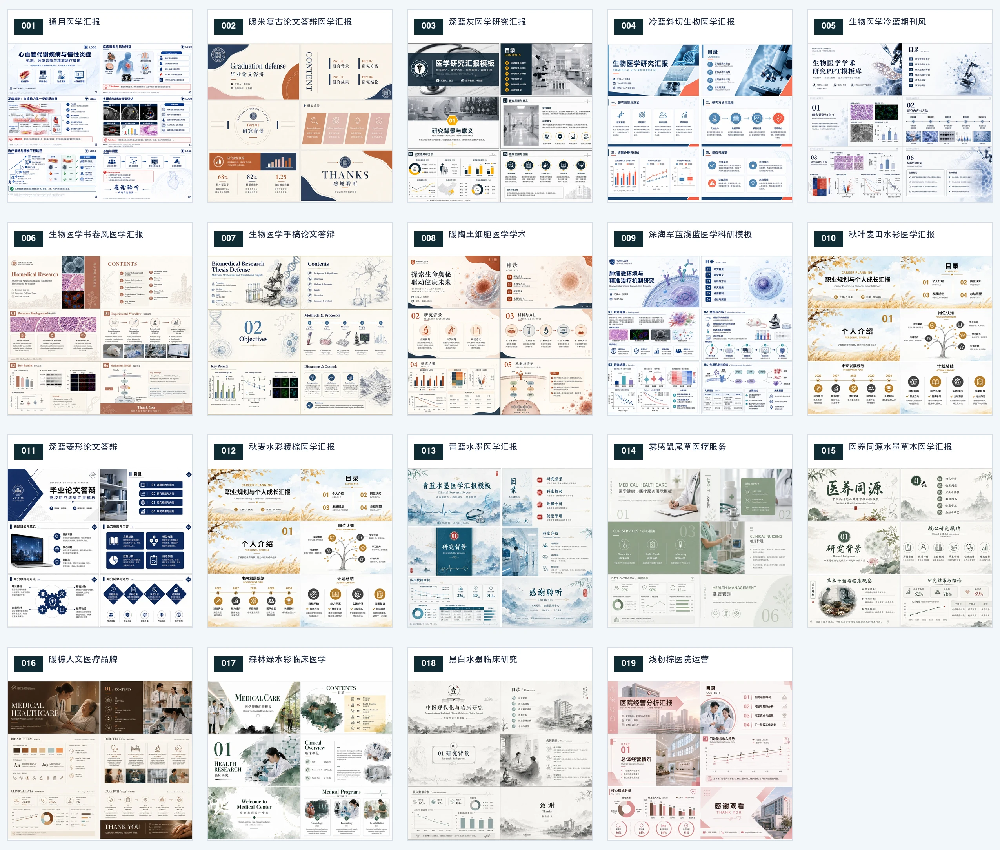

# yixueAIganhuo-PPT

[中文](README.md) | [English](README.en.md)

把医学论文、PDF、Figure、截图和参考资料自动整理成医学学术 PPT。
默认同时交付 **图片型 PPTX** 和 **对象级可编辑 PPTX**，并写入每页中文 speaker notes。



## 这个项目能做什么

`yixueAIganhuo-PPT` 是一个面向 Codex 的医学 PPT 自动化 skill。它把医学材料理解、幻灯片视觉生成和可编辑 PPT 重建拆成三段：

1. **父 agent 编排上游**：读取论文、PDF、Figure、截图，完成医学理解、Figure 盘点、PPT 结构规划和每页讲稿备注。
2. **中游 GPT Image 2 生成图片型 PPT**：按页生成统一风格的医学学术 slide image，并组装图片型 PPTX。
3. **下游 page worker 重建可编辑 PPT**：把每页图像拆解成文字、图片资产、线条、卡片、表格、坐标轴和 PPT 原生 shape，最终生成可编辑 PPTX。

最终默认交付：

- `editable PPTX`：对象级可编辑，文字可改，图片、卡片、线条和图表元素可调整。
- `image-only PPTX`：整页图片版本，适合分享、归档和兜底展示。
- `speaker notes`：每页默认生成中文讲稿备注，不需要额外选择。

## 效果展示：图片型 PPTX vs 可编辑 PPTX

左侧是图片型 PPTX，右侧是可编辑 PPTX。右侧截图中可以看到 PowerPoint 全选后的文本框、图片框和 shape 边界。









## 19 种风格可选

生成前可以选择 001-019 号风格。不选择时默认使用 `001 通用医学汇报PPT风格`。



## 适合哪些场景

- 📖 医学文献精读 PPT
- 🧪 SCI 论文组会汇报
- 🏥 科室教学课件
- 🩺 病例讨论和专题学习
- 📚 指南、综述、共识类内容整理
- 🖼️ Figure-heavy 的医学研究汇报

## 环境要求

### 1. Codex

本项目作为 Codex skill 使用，需要在 Codex 环境中运行。推荐使用 **GPT Pro** 会员完成完整流程。

Plus 会员也可以使用，但 token 额度可能更适合**只生成图片型 PPTX**；如果要完整跑完医学上游规划、GPT Image 2 按页生成、下游 page worker 可编辑重建，可能会遇到 token 或任务长度限制。

### 2. PaddleOCR-VL API token

下游可编辑重建需要更准确地识别页面文字，建议提前准备 PaddleOCR-VL token。
通过 https://aistudio.baidu.com/account/accessToken 获取。PaddleOCR-VL 目前提供每日 2 万张免费处理额度。

## 安装

### 手动安装

把本仓库放到 Codex skills 目录：

```bash
mkdir -p ~/.codex/skills
git clone https://github.com/snowmanzhuang/yixueAIganhuo-PPT.git ~/.codex/skills/yixueAIganhuo-PPT
```

进入仓库后安装依赖：

```bash
cd ~/.codex/skills/yixueAIganhuo-PPT
python3 -m pip install -r requirements.txt
```

如果你的环境使用虚拟环境或 `uv`，可以按自己的 Python 环境管理方式安装依赖。

### 让 Codex 帮你安装

如果你不想自己敲命令，可以直接对 Codex 说：

```text
帮我把 https://github.com/snowmanzhuang/yixueAIganhuo-PPT 安装或更新到 ~/.codex/skills/yixueAIganhuo-PPT，然后进入这个目录，按 requirements.txt 安装 Python 依赖。
```

## 快速开始

在 Codex 中直接提出任务，例如：

```text
请使用 yixueAIganhuo-PPT skill，把 ./paper.pdf 做成 12 页中文医学汇报 PPT。
```

也可以提供 Figure 文件夹、截图、已有参考资料：

```text
请使用 yixueAIganhuo-PPT skill，基于 ./paper.pdf 和 ./figures/ 生成 15 页中文课题组汇报 PPT，风格 009。
```

如果没有提前说明页数和风格，skill 会先询问：

```text
请先回答下面几个问题：

1️⃣ 页数：这次生成多少页 PPT？

2️⃣ 风格：请打开风格选择页，选 001-019 后回复序号。
不选则默认：001 通用提示词风格。

3️⃣ OCR：未检测到 PaddleOCR-VL token。
需要更准的文字识别，请打开这里获取 token：
https://aistudio.baidu.com/account/accessToken
然后回复 token；也可以回复“跳过”继续。
```

页数是必须确认的；风格不选则默认 `001`。speaker notes 默认生成，不需要单独选择。

## 输入材料

支持输入：

- 📄 医学论文 PDF
- 📚 指南、综述、共识、报告类 PDF
- 🖼️ Figure 图片文件夹
- 🔬 实验结果截图、表格截图、影像截图
- 📊 已有 PPT、图片型 PPT 或导出的 slide images
- 🎯 用户补充的目标受众、汇报场景、页数和风格编号

🧠 如果输入是论文或资料，skill 会走完整创作流程：医学理解、Figure 盘点、PPT 规划、按页生成、可编辑重建。
🔁 如果输入已经是现成的 slide 截图或图片型 PPT，skill 会走直接视觉转换流程，尽量保留原页面并转成可编辑 PPTX。

## 输出结构

一次完整运行通常会生成类似结构：

```text
output/yixueAIganhuo-PPT/<run_id>/
├── plans/
│   └── ppt_plan.json
├── prompts/
│   └── slideNN.txt
├── slides/
│   └── slideNN.png
├── slide_results/
│   └── slideNN.json
├── editppt_run/
│   ├── pages/
│   ├── manifest.json
│   └── final outputs
├── editable.pptx
├── image-only.pptx
└── notes_manifest.json
```

实际文件名会根据运行目录和 `editppt` 输出略有差异，但最终报告会明确列出：

- `editable_output`
- `image_only_output`
- 页数
- speaker notes 状态
- 验证结果
- warning / retry 信息

## 注意事项

- 医学内容应由使用者复核，尤其是诊断、治疗、指南推荐和统计结论。
- 原始证据图应来自用户提供的论文、Figure、截图或可信资料。
- 可编辑 PPTX 是结构化重建结果，不保证 100% 等同人工精修排版。
- 极复杂表格、密集多图页和特殊图表可能需要人工局部微调。
- Plus 会员可能更适合先生成图片型 PPTX；完整可编辑重建推荐 GPT Pro。

## 联系


## 致谢

本项目的 page worker 大部分参考了 [image-to-editable-ppt-skill](https://github.com/ningzimu/image-to-editable-ppt-skill)，感谢原项目作者的开源工作。
